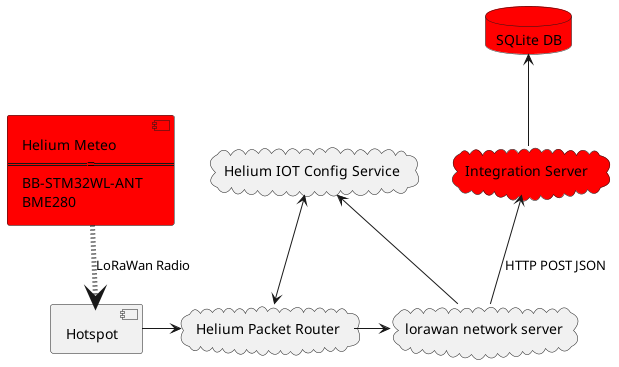

## Introduction


Helium Meteo is a small battery-powered device for measuring temperature, humidity and atmospheric pressure. Data samples are transmitted via [Helium](https://www.helium.com/) LoRaWan.

Data is received from the Helium network by the provided simple  implementation. A cheap ARM single-board computer is usually sufficient to run it at home.

See below an overview of the software architecture below. This project provides the components colored in red:



## BOM

 - Olimex [BB-STM32WL-ANT](https://www.olimex.com/Products/IoT/LoRa/BB-STM32WL/).
 - Olimex [MOD-BME280](https://www.olimex.com/Products/Modules/Sensors/MOD-BME280/open-source-hardware).

Wiring is simple - connect ground, VCC and I2C from MOD-BME280 to the respective pins of BB-STM32WL. There is no need for pull-ups - MOD-BME280 already has them.

## Getting Started

Before getting started, make sure you have a proper Zephyr development
environment. You can follow the official
[Zephyr Getting Started Guide](https://docs.zephyrproject.org/latest/getting_started/index.html).

### Initialization

The first step is to initialize the workspace folder where the
`helium_meteo` and needed Zephyr modules will be cloned. You can do
that by running:

```shell
# initialize workspace for the helium_meteo (main branch)
west init -m https://github.com/dinuxbg/helium_meteo --mr main helium_meteo_project
# update Zephyr modules
cd helium_meteo_project/helium_meteo
west update
```

### Build & Run

The application can be built by running:

```shell
west build -d build -b olimex_lora_stm32wl_devkit@D -s helium_meteo/app  --pristine
```

Once you have built the application you can flash it by running:

```shell
west flash
```

### Serial terminal

Hook a serial UART to LPUSART1. You would get access to a shell running on the device, where you can setup the Helium/LoRaWan keys and tweak other settings.

```shell
screen /dev/ttyACM0 9600
```

Type `help` to get a list of supported commands.

### Configuring Helium parameters
In order to connect to the Helium network, you must first set the [keys](https://docs.helium.com/console/adding-devices/). Reboot the board after that for the settings to take effect.
```
lorawan dev_eui AABBCCDDEEFF0011
lorawan app_eui 0102030405060708
lorawan app_key 123456789ABCDEFFEDCBA98765432101
lorawan auto_join true
kernel reboot cold
```


## Acknowledgements
## Acknowledgements

This project is heavily based on https://github.com/retfie/helium_mapper .

## TODO
 - Design a custom PCB.
 - Create a custom board definition for Zephyr instead of inheriting stm32wl_devkit.
 - Add more documentation (e.g. how to setup Helium/LoRaWan keys).
 - Add battery voltage measurement to the Lora packet.
